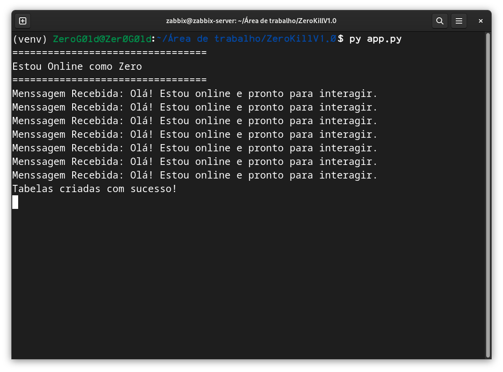

# Zero
Um bot para Discord que oferece uma variedade de funcionalidades.

## Instalação via Git

Para clonar o repositório, execute o seguinte comando:

```bash
git clone https://github.com/Zer0G0ld/Zero
```

## Ambiente Virtual - AV

### Criando um Ambiente Virtual

Para criar um ambiente virtual, execute:

```bash
python3 -m venv venv
```

### Ativando o Ambiente Virtual

**No Linux ou MacOS:**

```bash
source venv/bin/activate
```

**No Windows:**

```cmd
.\venv\Scripts\Activate
```

### Desativando o Ambiente Virtual

Para desativar o ambiente virtual, execute:

```bash
deactivate
```

### Instalando Dependências

Para instalar as dependências do projeto, use o comando:

```bash
pip install -r requirements.txt
```

## Informações sobre o Projeto

O projeto está organizado em pastas para facilitar a navegação e a compreensão.

### Arquivo Principal

O arquivo principal é o `app.py`. Para rodar o bot, execute o comando:

```bash
python3 app.py
```



Isso indica que o bot está online e pronto para interagir.

### Chamar o Bot

Para chamar o bot, utilize o prefixo `$`. Você pode modificar o prefixo alterando a seguinte linha no código:

```python
bot = commands.Bot(command_prefix="$", intents=intents, description=description)
```

### Eventos

O bot possui dois eventos decorados com `@bot.event`, como mostrado a seguir:

```python
@bot.event
async def on_ready():
    logger.info(f"Bot está online como {bot.user.name}")
    print(f"=================================")
    print(f"Estou Online como {bot.user.name}")
    print(f"=================================")

    for guild in bot.guilds:
        for channel in guild.text_channels:
            if channel.permissions_for(guild.me).send_messages:
                with open('src/saudacao.gif', 'rb') as f:
                    picture = discord.File(f)
                    await channel.send("Olá! Estou online e pronto para interagir.", file=picture)

    bot.add_cog(Economy(bot))

    cog = bot.get_cog('Economy')
    if cog:
        logger.info("Cog Economy carregada com sucesso.")
    else:
        logger.error("Erro ao carregar a cog Economy.")
```

```python
@bot.event
async def on_message(message):
    logger.info(f"Mensagem recebida de {message.author}: {message.content}")
    print(f"Menssagem Recebida: {message.content}")

    if not message.author.bot:
        user_id = message.author.id
        data_manager = bot.get_cog('Economy').data_manager
        if not data_manager.user_exists(user_id):
            data_manager.register_new_user(user_id)
            await message.channel.send(f"Bem-vindo, {message.author.mention}! Uma nova conta foi criada para você com 100 moedas iniciais.")
    await bot.process_commands(message)
```

### Comandos

Os comandos estão organizados no diretório `commands`, onde cada arquivo representa uma classe ou funcionalidade diferente.


Além dos arquivos de comandos, existe um diretório chamado `utils`, que contém o banco de dados.

### Utils

No diretório `utils`, você encontrará o arquivo `data.py`, que gerencia o banco de dados `data.db`.


#### Classes no `data.py`

Dentro de `data.py`, há duas classes:

- **Database**: Um gerenciador de contexto que abre uma conexão com o banco de dados SQLite.
- **DataManager**: Responsável por operações como criar tabelas, verificar se um usuário existe, registrar um novo usuário e gerenciar moedas.

## Licença

Este projeto está sob a licença [GNU](https://github.com/Zer0G0ld/Zero/blob/main/LICENSE).
